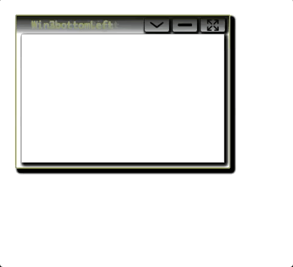
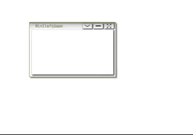

## LWW - LightWeight Window

#### Tiny, simple JS library to create and manage multiple windows.

Demo: https://rawgit.com/yngve-sk/lww.js/master/demo-v2/index.html

Screenshots (8 docks with different flow directions with 3 windows each)

Lightweight JS windowing library. Features:
* Minimize to a dock
* Multiple docks
* Maximize windows
* Collapse windows
* Enable / disable features easily
* Smooth resizing and relocating behavior

Inspired by on drag-resize-snap by arctelix ( https://github.com/arctelix/drag-resize-snap ).

#### installation:

    npm install lww.js

#### Usage:

TODO, see demo/ to see how it is used.

#### Contibuting:
 Contributions are very welcome, the source code is (hopefully) pretty straight forward.