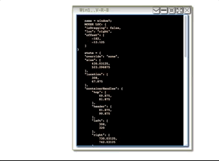
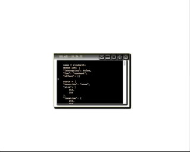

## LWW - LightWeight Window

#### Tiny, simple JS library to create and manage multiple windows.

Demo: https://rawgit.com/yngve-sk/lww.js/master/demo-v2/index.html

Note: The text area inside the windows contain the configuration JSON object to get the window in its current state. Disregard the containerHandles in the config - these are calculated and does not need to be specified at all in the initial config.

Screenshots:





Lightweight JS windowing library.

Implemented features:
* Minimize to a dock
* Multiple docks
* Maximize windows
* Minsize windows (set size to minimum size)
* Collapse windows
* Enable / disable buttons + functionality easily
* Resizing and relocating
* Min/max bounding of container size
* Injecting angular content (Though you must provide your own injector function)

TODO features:
* Positioning next to arbitrary HTML elements
* Adding icons for windows
* Improve styling


(Inspired by on drag-resize-snap by arctelix ( https://github.com/arctelix/drag-resize-snap ).)


#### installation:

    npm install lww.js

#### Usage:
Example initialization of two windows, attached to a dock on the right, flowing
vertically downwards. (If ```anchor.y``` is set to ```'bottom'``` it will flow upwards, and so on).

See the demo + its code for a more complete example

```
let LWWManager = require('lww.js');

// If using angular and ng-app is not document.body this is necessary
LWWManager.setParent(document.getElementById('main-app-container'));

LWWManager.createDock('right', {
    anchor: {
        x: 'right',
        y: 'top',
        offset: '15%',
        flow: 'vertical'
    },
        buttonHeight: 45,
        buttonLength: 150,
        hideLabels: true,
        showIcons: true
    });

LWWManager.addWindow('window1', {
    options: {
        title: 'Window One',

        // Enable needed buttons, and they will show in that order
        // I.e the array order is the order in which the buttons appear
        // @ the window!

        buttons: ['collapse', 'minimize'],
        bounds: {
            min: [180, 220],
            max: [200, 800],
            headerHeight: 25,
        },
        resizeMargin: 6, // Size of the resizing area on the window
        icon: undefined, // TODO
        dock: {
            name: 'right' // must match an existing dock
        }
    },
    state: {
        override: 'none', // 'collapse', 'minimize', 'minsize', 'maximize'
        size: [150, 500],
        location: [350, 350]
    }
});

LWWManager.addWindow('window2', {
    options: {
        title: 'Window Two',

        buttons: ['collapse', 'minimize', 'maximize', 'minsize', 'close'],

        bounds: {
            min: [400, 300],
            max: [800, 800],
            headerHeight: 25,
        },

        resizeMargin: 6,
        icon: undefined,
        dock: {
            name: 'right'
        }
    },
    state: {
        override: 'none',
        size: [450, 450],
        location: [250, 250]
    }
});


let Window1 = LWWManager.getWindow('window1');
let Window2 = LWWManager.getWindow('window2');

let Window1Content = Window1.DOM.content;
let Window2Content = Window2.DOM.content;
```
### API
TODO


### Gotchas
* When injecting angular content, the window must be placed within the ng-app container. If your ng-app is simply the body of the document this will not be a problem. Otherwise, if your ng-app is inside another element, pass in that element before creating any windows:
    ```
    LWWManager.setParent(ngAppContainerElement)
    ```
* Pressing the close-button will effectively destroy the window and its DOM, i.e it cannot be undone.

#### Contibuting:
 Contributions + bug reports/fixes are very welcome, the source code is (hopefully) pretty straight forward. The code is divided into only 3 classes, and most of the code in window class is purely boilerplate event binding / simple rectangle geometry.